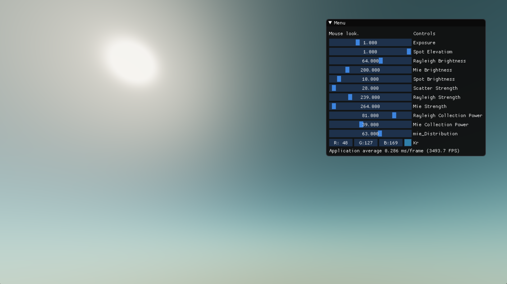
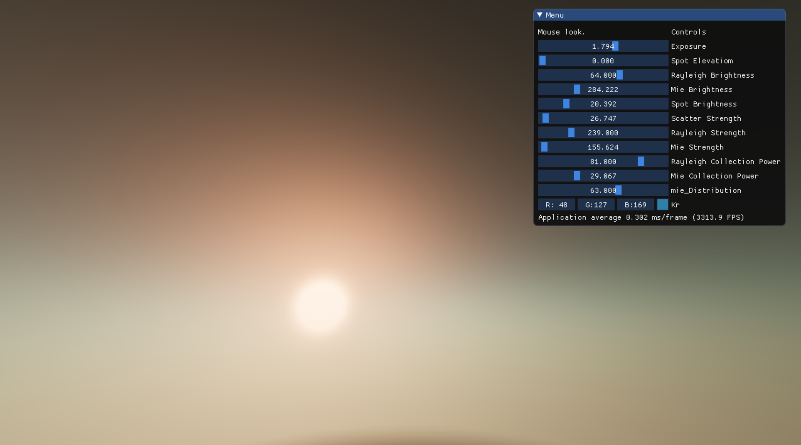

# Atmospheric Scattering (codeflow.org)

This code is preserved for posterity from [codeflow.org](https://web.archive.org/web/20200313091416/http://codeflow.org/entries/2011/apr/13/advanced-webgl-part-2-sky-rendering/), which is now no longer online. It explains how to render a realistic sky in GLSL by ray‐marching through a simplified spherical atmosphere.

## Demo

[Live Demo Link](https://binaryfoundry.github.io/scattering/)

## Preserved Article

https://binaryfoundry.github.io/Atmospheric-Scattering/
